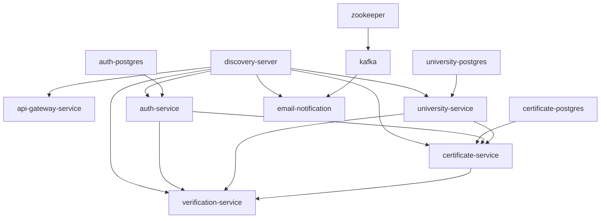

# Backend Services Deployment Dependency Map

## Service Architecture Dependencies

## Deployment Order Strategy

### Phase 1: Infrastructure (Databases & Messaging)
1. **auth-postgres** - Auth service database
2. **university-postgres** - University service database  
3. **certificate-postgres** - Certificate service database
4. **zookeeper** - Kafka coordination service
5. **kafka** - Message broker for email notifications

### Phase 2: Core Services
6. **discovery-server** - Service registry (Eureka)
7. **auth-service** - Authentication & JWT management
8. **university-service** - University management & verification

### Phase 3: Business Services  
9. **certificate-service** - Certificate issuance & management
10. **verification-service** - Certificate verification (uses university + certificate)
11. **email-notification** - Email notifications via Kafka

### Phase 4: Gateway
12. **api-gateway-service** - API Gateway (needs discovery server)

## Service Dependencies

| Service | Depends On | Database | External Dependencies |
|---------|------------|----------|----------------------|
| discovery-server | None | None | None |
| auth-service | discovery-server | auth-postgres | None |
| university-service | discovery-server | university-postgres | None |
| certificate-service | auth-service, discovery-server | certificate-postgres | auth-service |
| verification-service | certificate-service, university-service | None (shares certificate-postgres) | None |
| email-notification | kafka, zookeeper | None | kafka, zookeeper |
| api-gateway-service | discovery-server | None | discovery-server |

## Health Check Requirements

### Database Health Checks
- **PostgreSQL**: `pg_isready` command
- **Kafka**: Topic creation test
- **Zookeeper**: Connection test

### Service Health Checks  
- **discovery-server**: `/actuator/health` endpoint
- **auth-service**: `/api/auth/health` or `/actuator/health`
- **university-service**: `/api/universities/health` or `/actuator/health`
- **certificate-service**: `/api/certificates/health` or `/actuator/health`
- **verification-service**: `/api/verification/health` or `/actuator/health`
- **email-notification**: `/api/email/health` or `/actuator/health`
- **api-gateway-service**: `/actuator/health`

## Port Allocation

| Service | Internal Port | External Port | Type |
|---------|---------------|---------------|------|
| discovery-server | 8761 | 30259 | NodePort |
| auth-service | 8081 | 30081 | NodePort |
| university-service | 3002 | 30086 | NodePort |
| certificate-service | 3003 | 30085 | NodePort |
| verification-service | 3004 | 30044 | NodePort |
| email-notification | 8080 | 32493 | NodePort |
| api-gateway-service | 8080 | 30082 | NodePort |
| auth-postgres | 5432 | - | ClusterIP |
| university-postgres | 5432 | - | ClusterIP |
| certificate-postgres | 5432 | - | ClusterIP |
| kafka | 9092 | - | ClusterIP |
| zookeeper | 2181 | - | ClusterIP |

## Deployment Timing

### Recommended Wait Times
- **PostgreSQL startup**: 60-120 seconds
- **Kafka/Zookeeper**: 90-180 seconds  
- **Spring Boot services**: 120-300 seconds
- **Service registration**: 30-60 seconds after startup

### Critical Success Factors
1. **Database must be fully ready** before dependent service starts
2. **Discovery server must be ready** before other services register
3. **Kafka must be ready** before email-notification starts
4. **Health checks must pass** before marking deployment successful